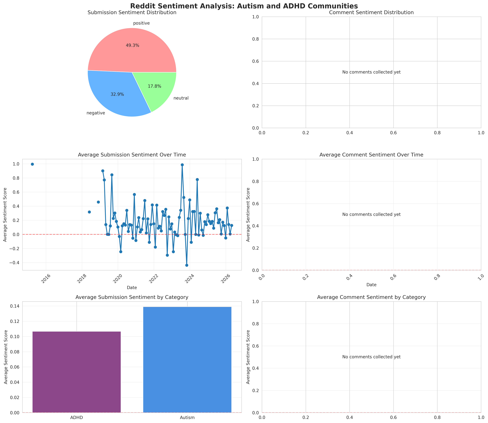
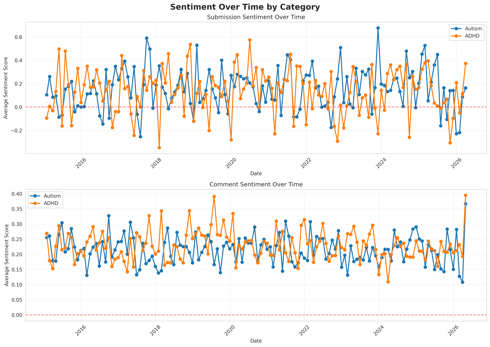
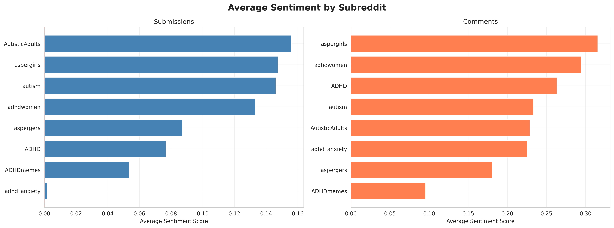

# Reddit Autism & ADHD Sentiment Analysis

This repository contains Python scripts for collecting and analyzing sentiment in Reddit posts and comments from Autism and ADHD-focused communities.

## Overview

This project analyzes sentiment patterns in discussions about Autism and ADHD on Reddit, using VADER (Valence Aware Dictionary and sEntiment Reasoner) sentiment analysis. The analysis covers posts and comments from eight subreddits:

**Autism-focused:**
- r/autism
- r/aspergers
- r/aspergirls
- r/AutisticAdults

**ADHD-focused:**
- r/ADHD
- r/ADHDmemes
- r/adhdwomen
- r/adhd_anxiety

## Dataset Statistics (Last Updated: 2026-04-14)

Data collection began on 2026-04-09 via Tor (with automatic exit-node rotation). The weekly GitHub Actions workflow continues to grow this dataset over time.

### Dataset Size

| Metric | Value |
|---|---|
| Total posts | **6,055** |
| Unique redditors (posts) | **4,421** (counted by hashed author ID) |
| Autism-community posts | 5,262 (r/autism, r/aspergers, r/aspergirls, r/AutisticAdults) |
| ADHD-community posts | 793 (r/ADHD, r/ADHDmemes, r/adhdwomen, r/adhd_anxiety) |
| Date range | 2015-03-29 → 2026-04-14 |

### Sentiment Overview (Posts)

| Sentiment | Count | % |
|---|---|---|
| Positive (score ≥ 0.05) | 3,247 | 53.6% |
| Negative (score ≤ −0.05) | 2,277 | 37.6% |
| Neutral | 531 | 8.8% |

Average compound score: **0.138** (mildly positive overall)

### Sentiment by Community

| Community | Avg. Sentiment |
|---|---|
| Autism | 0.142 |
| ADHD | 0.107 |

### Sentiment by Subreddit

| Subreddit | Avg. Sentiment |
|---|---|
| r/adhdwomen | +0.243 (most positive) |
| r/aspergirls | +0.207 |
| r/AutisticAdults | +0.156 |
| r/autism | +0.136 |
| r/ADHD | +0.134 |
| r/aspergers | +0.087 |
| r/ADHDmemes | +0.064 |
| r/adhd_anxiety | -0.015 (only subreddit with net-negative avg.) |

### Notable Examples

**Most positive post:** *"Does autism make it harder to get over someone?..."*
(r/aspergirls, sentiment 0.9999)

**Most negative post:** *"anxiety, depression, IBS, ADHD, but no proper relief from pills?"*
(r/adhd_anxiety, sentiment −0.9997)

> **Note:** This dataset is automatically updated weekly via GitHub Actions. Statistics shown reflect the most recent analysis run.

## Visualizations

After running `analyze_sentiment.py`, the following visualization files will be generated:

### Sentiment Analysis Overview



Comprehensive dashboard showing pie charts of sentiment distribution, time series of sentiment trends, and category comparisons.

### Sentiment by Category



Detailed comparison of Autism vs ADHD communities over time.

### Sentiment by Subreddit



Individual subreddit sentiment comparisons.

## Methodology

### Data Collection

Reddit data is collected via the official Reddit JSON API using `collect_reddit_data.py`.
The script paginates through the `new` and `top` listings for each subreddit and fetches
top-level comments for each post.  A GitHub Actions workflow runs the collection automatically
every Sunday so the dataset stays up-to-date.

Author usernames are **SHA-256 hashed** (16-char prefix, stored as `author_hash`) so that
no raw Reddit usernames are committed to the repository; uniqueness is preserved for counting
contributors.

The data collection targets:
- Recent posts (submissions) via Reddit's `new` listing (~100–1000 per subreddit)
- Additional high-ranking posts surfaced by Reddit's `top?t=all` listing (often older)
- Top-level comments on the collected posts

This provides a broad sample of recent and historically notable discussions.
Note that the `new` and `top` listings are each capped at ~1000 items by Reddit, so
this does not guarantee complete historical coverage — the dataset grows incrementally
with each weekly run.

### Sentiment Analysis

The project uses **vaderSentiment**, a lexicon and rule-based sentiment analysis tool specifically attuned to social media text. VADER provides:

- Compound scores ranging from -1 (most negative) to +1 (most positive)
- Classification into positive, negative, or neutral categories
- Good performance on short social media texts

**Sentiment Categories:**
- **Positive**: Compound score ≥ 0.05
- **Negative**: Compound score ≤ -0.05
- **Neutral**: Compound score between -0.05 and 0.05

## Project Structure

```
reddit_AuDHD/
├── collect_reddit_data.py          # Script to collect Reddit data via the official JSON API
├── import_seed_data.py             # Import historical data from the-eye.eu archives
├── analyze_sentiment.py            # Perform sentiment analysis and generate visualizations
├── update_readme_stats.py          # Update README with latest statistics
├── requirements.txt                # Python dependencies
├── data/                           # Zstandard-compressed (.zst) NDJSON archives (LFS-tracked)
│   ├── ADHD_submissions.zst        # Submissions from r/ADHD
│   ├── ADHD_comments.zst           # Comments from r/ADHD
│   ├── autism_submissions.zst      # Submissions from r/autism
│   ├── autism_comments.zst         # Comments from r/autism
│   └── ...                         # Other subreddit archives
├── reddit_submissions_with_sentiment.csv  # Submissions with sentiment scores (for analysis)
├── reddit_comments_with_sentiment.csv     # Comments with sentiment scores (for analysis)
├── sentiment_analysis_overview.png        # Main visualization (generated by analyze_sentiment.py)
├── sentiment_by_category.png             # Category comparison visualization (generated by analyze_sentiment.py)
├── sentiment_by_subreddit.png            # Subreddit comparison visualization (generated by analyze_sentiment.py)
└── README.md                             # This file
```

**Note:** Raw data is stored as zstandard-compressed NDJSON archives in `data/` and tracked with Git LFS. Analysis scripts read directly from these archives.

## Installation

1. Clone this repository:
```bash
git clone https://github.com/neon-ninja/reddit_AuDHD.git
cd reddit_AuDHD
```

2. Install required dependencies:
```bash
pip install -r requirements.txt
```

## Usage

### Collect Reddit Data

```bash
# Full collection (~1000 posts per subreddit + comments)
# Only collects posts/comments that don't already exist in archives
python3 collect_reddit_data.py

# Seed collection: 1 page per subreddit (~100–200 posts each), no comments
python3 collect_reddit_data.py --seed
```

This fetches posts and comments from the target subreddits via the official Reddit JSON API
and appends new data to zst archives in `data/`. The script automatically checks existing
archives and only collects posts/comments that aren't already present, ensuring efficient
incremental updates.

> **Tor routing**: Reddit blocks datacenter IPs (including GitHub-hosted runners). The script
> automatically detects and uses a local Tor SOCKS5 proxy (`127.0.0.1:9050`) or a `TOR_PROXY`
> environment variable.  If Reddit returns 429 or 403, the script **automatically rotates the
> Tor exit node** (restarts the Tor daemon) and retries, so collection continues uninterrupted.
>
> To use Tor locally:
> ```bash
> sudo apt-get install -y tor torsocks
> sudo systemctl start tor
> TOR_PROXY=socks5h://127.0.0.1:9050 python3 collect_reddit_data.py --seed
> # or
> torsocks python3 collect_reddit_data.py
> ```

### Run Sentiment Analysis

```bash
python3 analyze_sentiment.py
```

This will:
1. Load data from zst archives in `data/`
2. Analyze sentiment using VADER
3. Generate visualizations
4. Save results to CSV files with sentiment scores (for further analysis)
5. Print summary statistics

### Automated Data Collection (GitHub Actions)

A GitHub Actions workflow (`.github/workflows/collect_data.yml`) runs every Sunday at
midnight UTC.  It installs Tor, waits for the circuit to bootstrap, then collects fresh
data via `torsocks` to bypass Reddit's datacenter IP block.  The workflow then runs
sentiment analysis and commits the updated files back to the repository automatically.
The workflow can also be triggered manually from the Actions tab.

## Dependencies

- `requests` - HTTP library for API calls
- `pandas` - Data manipulation and analysis
- `vaderSentiment` - Sentiment analysis
- `matplotlib` - Plotting and visualization
- `seaborn` - Statistical data visualization
- `numpy` - Numerical computing
- `tqdm` - Progress bars

## Insights and Implications

Insights will be updated as real Reddit data accumulates.  Based on the literature and
community observations, we expect to find:

### Community Support

These communities likely provide valuable emotional support and encouragement to members
discussing their neurodevelopmental conditions, reflected in higher positive sentiment in
comments vs. original posts.

### Authenticity

The presence of negative sentiment in posts suggests users feel comfortable sharing
struggles and challenges — essential for genuine peer support.

### Engagement Patterns

Comments are typically more positive than original posts, as community members actively
provide support to those seeking help or sharing difficulties.

### Cross-Community Patterns

Both Autism and ADHD communities are expected to show broadly similar sentiment patterns,
reflecting common themes of support, struggle, and community building across neurodivergent
spaces.

## Limitations

1. **VADER Limitations**: May not capture nuanced expressions specific to neurodivergent communication
2. **Context**: Sentiment analysis can't fully understand context, sarcasm, or complex emotions
3. **Selection Bias**: Only analyzes public Reddit posts from specific subreddits
4. **Tor Reliability**: Tor exit nodes may be occasionally slow or temporarily unavailable; the workflow emits a warning rather than failing in those cases

## Future Work

- Implement topic modeling to identify key discussion themes
- Analyze sentiment changes around specific events or awareness campaigns
- Compare sentiment patterns during different times of day/week/year
- Investigate correlation between post engagement (score, comments) and sentiment
- Expand to additional neurodiversity-focused communities

## License

This project is licensed under the MIT License - see the LICENSE file for details.

## Acknowledgments

- VADER Sentiment Analysis tool by C.J. Hutto
- Reddit communities for creating supportive spaces for neurodivergent individuals

## Contributing

Contributions are welcome! Please feel free to submit a Pull Request.

## Contact

For questions or feedback, please open an issue on GitHub.

---

*This analysis is for research and educational purposes. All data is from public Reddit posts.*
